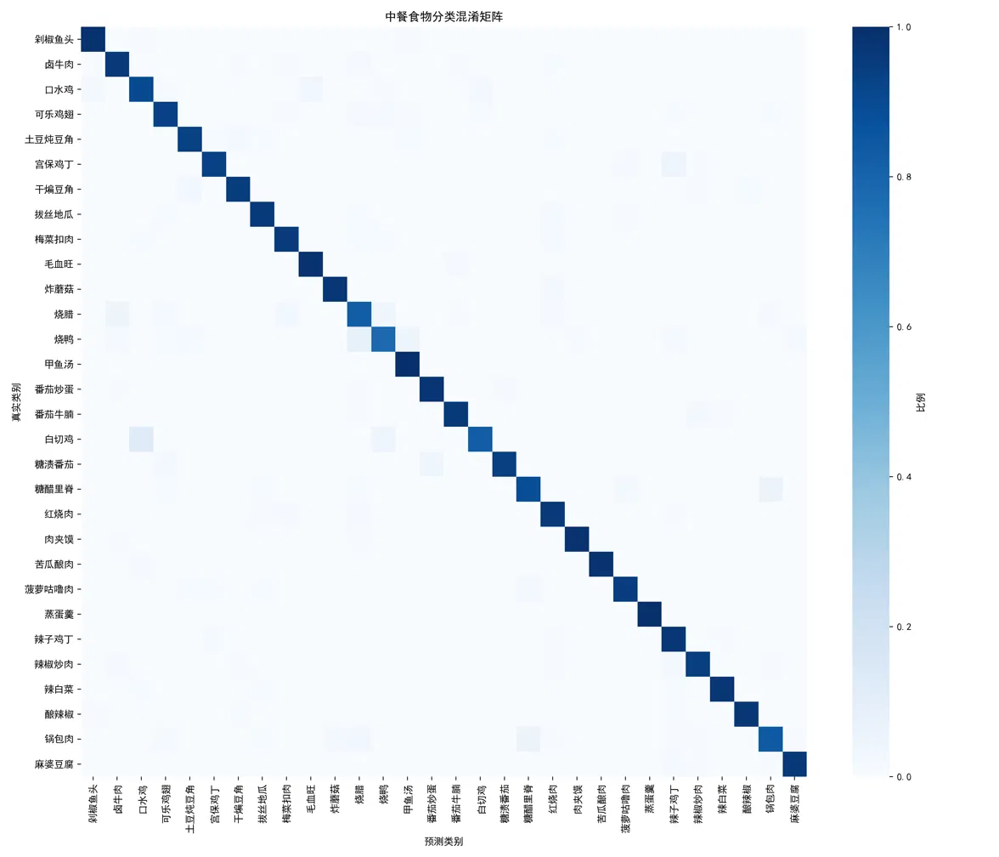
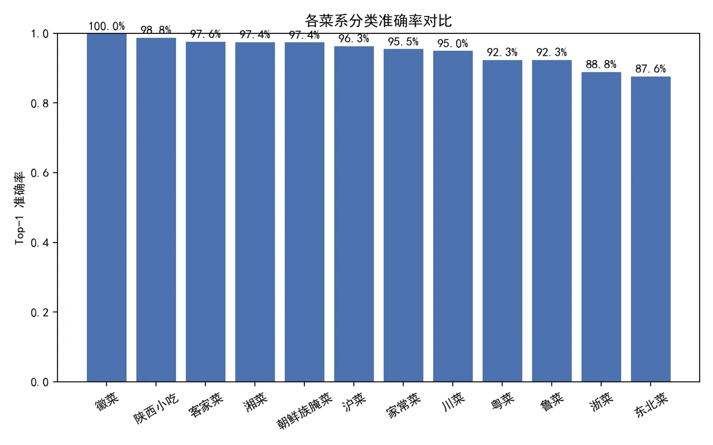
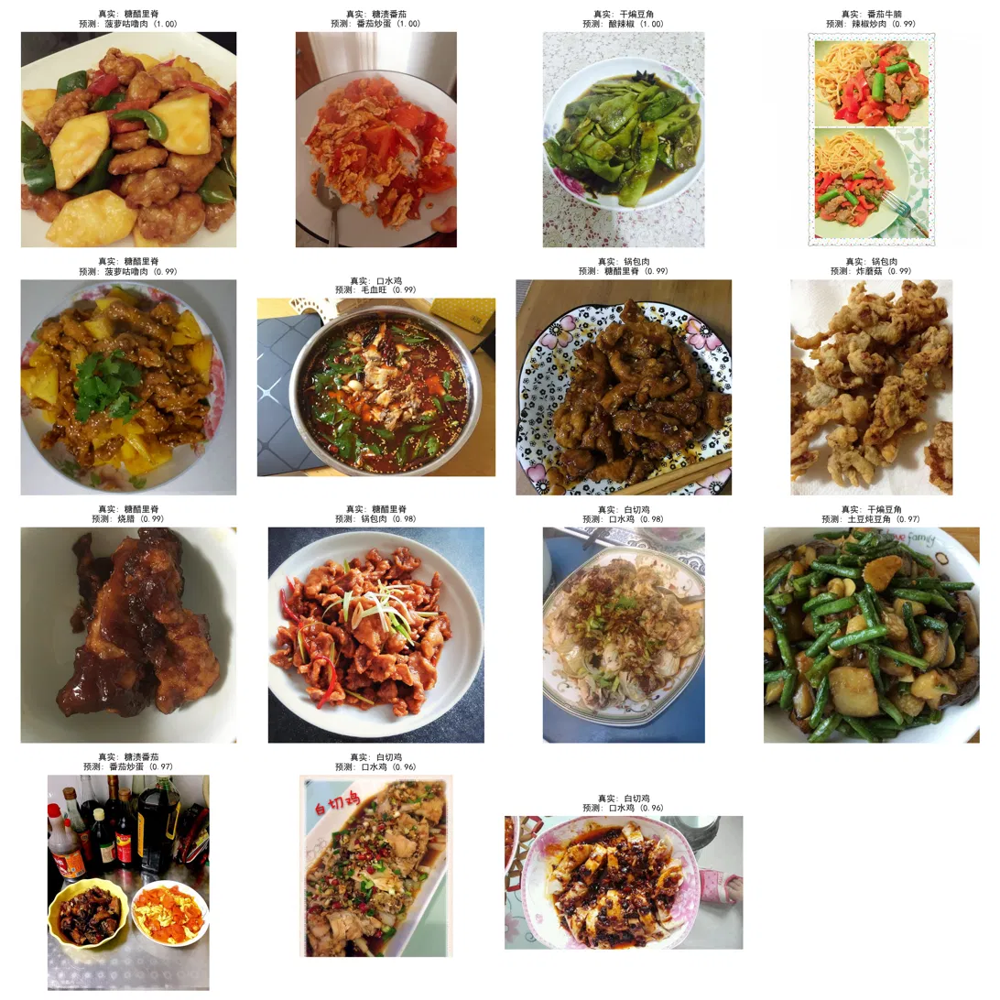
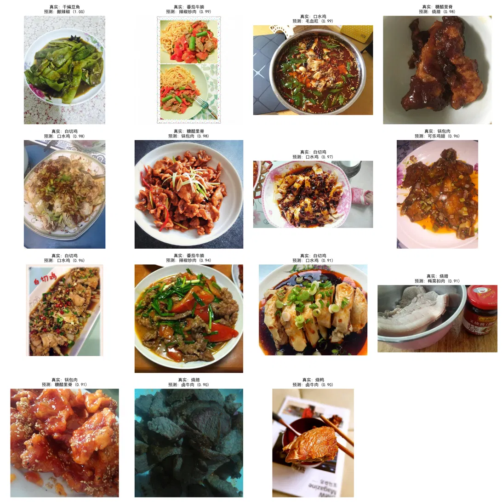

# 中餐食物VLM分类实验分析报告（任务4）

## 一、实验回顾

本次实验基于 Chinese-CLIP（OFA-Sys/chinese-clip-vit-base-patch16），在 30 类、共 4503 张中餐图像的测试集上，依次完成了零样本分类、Prompt 模板对比、Few-shot 原型改进、Alpha 消融、LoRA 微调、以及 LoRA+数据增强 六组实验。核心结果汇总如下：

| 方法 | Top-1 | Top-5 |
|------|-------|-------|
| Zero-shot（最佳模板"一道美味的{}"） | 84.28% | 96.98% |
| Few-shot 纯图像原型 | 88.30% | 98.60% |
| Few-shot 图文融合（alpha=0.6，最佳） | 90.63% | 99.07% |
| LoRA 微调 | 93.76% | 99.56% |
| **LoRA微调 + 数据增强（最终版本）** | **94.12%** | **99.60%** |

以下第二至第四节的分析均基于该原始（清洗前）最终版本在完整测试集上的真实混淆矩阵、分菜系准确率与失败案例（并对失败案例做了人工复核）。在此基础上，第六节进一步展示了按复核结果清洗标注后重新训练的结果——**清洗后的LoRA微调+数据增强版本，最终达到 Top-1 96.33% / Top-5 99.86%**，是本报告中的最佳成绩，详见第六节。

## 二、混淆矩阵分析

 
图1 Lora微调+数据增强模型混淆矩阵

从混淆矩阵（`confusion_matrix.png`）来看，最终模型的整体表现非常干净：**30个类别中绝大多数对角线格子接近深蓝色（比例接近1.0）**，与94.12%的Top-1准确率相吻合。非对角线上的浅色格子集中在三组类别对上：

1. **白切鸡 ↔ 口水鸡**：两者底层食材完全相同（白切/白煮整鸡），差异主要在酱料浇淋方式，当图像裁剪只保留鸡肉主体、酱料被摆在旁边时，纯视觉上确实难以区分。

2. **烧腊 ↔ 烧鸭**：这组混淆的本质**不是模型能力问题，而是标签体系存在层级重叠**——烧腊在中餐分类里通常是包含烧鸭在内的上位概念，把两者并列为互斥的同级类别，标注边界天然模糊。人工复核失败案例后（见第四节）也确认了这一点。

3. **锅包肉 ↔ 糖醋里脊**：两道菜都是"挂糊炸制+酸甜芡汁裹肉"的做法，视觉上高度相似。

## 三、按菜系的分层分析

<!--左侧文字区域-->

分菜系准确率（`cuisine_accuracy.png`）排序如下：

| 排名 | 菜系 | Top-1准确率 |
|------|------|------|
| 1 | 徽菜 | 100.0% |
| 2 | 陕西小吃 | 98.8% |
| 3 | 客家菜 | 97.6% |
| 4 | 湘菜 | 97.4% |
| 5 | 朝鲜族腌菜 | 97.4% |
| 6 | 沪菜 | 96.3% |
| 7 | 家常菜 | 95.5% |
| 8 | 川菜 | 95.0% |
| 9 | 粤菜 | 92.3% |
| 9 | 鲁菜 | 92.3% |
| 11 | 浙菜 | 88.8% |
| 12 | 东北菜 | 87.6% |

   

   <!--右侧图表区域-->
   

      
      
图2 各菜系Top-1准确率估计

   

**关键发现：**

1. **准确率最低的两个菜系（东北菜87.6%、浙菜88.8%）与混淆矩阵中的问题类别高度对应**：东北菜的代表类别锅包肉正是混淆矩阵中对角线最浅、与糖醋里脊混淆最明显的类别。

2. **粤菜（92.3%）的短板同样能对应到具体类别**：粤菜下的白切鸡、烧腊、烧鸭正是第二节分析的两组主要混淆来源，说明粤菜整体分数被这几个类别拖累，而不是粤菜类别普遍偏难。

3. **菜系标签与视觉相似性不完全对齐**：徽菜、陕西小吃、客家菜等准确率接近100%的菜系，类别数少且彼此做法差异明显；而粤菜、鲁菜、东北菜内部存在"同做法不同地域命名"的菜品，准确率被系统性拉低。但结合第四节的复核结果，这里的"准确率偏低"里也混杂了一部分数据集标注错误带来的虚假失分，实际模型能力差距可能小于表格数值直接反映的差距，具体需要在完成数据集清洗后重新计算才能得出更可靠的分菜系结论。

## 四、失败案例分析（真实置信度版 + 人工复核终稿）

在修复评估代码中遗漏的 `logit_scale` 缩放问题后，重新导出的预测结果显示：**正确样本平均置信度 0.9466，错误样本平均置信度 0.6629**，两者有明显区分，说明模型整体概率校准是健康的。同时，265个错判样本中相当一部分置信度高达0.96~1.00——这正是Day3阶段在zero-shot基线上最早观察到的"自信地判断错误"现象。**这是一个重要的对比性发现**：该现象并没有随着LoRA微调消失，而是从zero-shot阶段的普遍现象，收窄成了最终版本里一小撮顽固存在的高置信度错判（265/4503，约5.9%），说明这类混淆背后的原因（标签体系重叠、真实视觉相似、少量标注错误）没有被训练过程"修复"，只是被压缩到了更小的比例。

对置信度最高的15个失败案例逐一做人工复核后，可以清晰地分成三类。

 
图3 错误样例

### 4.1 复核确认为"数据集标注错误"的案例（模型判断本身是对的）

1. **糖醋里脊 ↔ 菠萝咕噜肉（"酸甜裹汁炸物三角"，2例，置信度0.99~1.00）**：图像上能明显看到菠萝块等标志性配料，视觉内容与模型预测标签更吻合。
2. **糖渍番茄 → 番茄炒蛋（2例，置信度0.97~1.00）**：图像内容更接近番茄炒蛋的呈现方式。
3. **干煸豆角 → 土豆炖豆角（1例，置信度0.97）**：复核确认这一例并非食材品种差异，而是真值标签本身贴错了。
4. **锅包肉 → 炸蘑菇（1例，置信度0.99）**：复核确认图像内容更接近炸蘑菇，属于标注错误。

以上共6例，全部表现为**高置信度（≥0.97）**，这一点在方法论上很有意义：高置信度反而是支持"模型没错、标签错了"的证据，而不是"模型自信地犯错"——这提示后续做失败案例分析时，高置信度错判样本应当优先安排人工复核标签，而不是默认归因于模型能力不足。

### 4.2 复核确认为"真实视觉难点"的案例（人眼也难分辨，不算模型缺陷）

1. **白切鸡 → 口水鸡（3例，置信度0.96~0.98）**：两道菜底层食材完全相同（白切/白煮整鸡），仅酱料呈现方式不同，图像信息不足以稳定区分。
2. **番茄牛腩 → 辣椒炒肉（1例，置信度0.99）**：该样本实为意面配菜、非标准构图拼图，人眼也难以判断。
3. **干煸豆角 → 酿辣椒（1例，置信度1.00）**：复核确认测试图片使用的是**扁豆角**这一品种，与训练集常见的普通豆角外形差异明显，属于同类别内部因食材品种导致的视觉domain shift，是数据采集覆盖不均衡的问题，不是标注错误，也不是模型的判别缺陷。

### 4.3 复核确认为"模型真实识别错误"的案例（标签是对的，模型确实判断错了）

1. **糖醋里脊 → 烧腊（1例，置信度0.99）**：复核确认真值标签没有问题，模型在这一例上确实做出了错误且高置信度的判断，说明即使经过LoRA微调，模型仍然会在个别样本上出现类似Day3阶段观察到的"自信地判断错误"，只是这种情况已经被压缩到了极少数。
2. **锅包肉 ↔ 糖醋里脊（2例，置信度0.98-0.99）**：锅包肉和糖醋里脊同为酸甜裹汁炸物，日常制作过程中切块形状各异，同时受光线、调料影响料汁颜色不稳定，模型难以区分。
3. **口水鸡 → 毛血旺（1例，置信度0.99）**：口水鸡淋油没过鸡肉，加上辣椒遮挡，模型难以辨别。

### 4.4 三类案例的占比与含义

| 类别 | 案例数（15例中） | 含义 |
|------|------|------|
| 标注错误 | 6 | 应通过数据清洗解决，不应计入模型能力评估 |
| 真实视觉难点 | 5 | 数据本身的可分性上限问题，需要更均衡的数据采集或更细粒度的特征，非训练能解决 |
| 模型真实识别错误 | 4 | 真正体现模型能力局限的比例，占比很小 |

这一比例分布传递出一个关键信息：**94.12%这个Top-1准确率被系统性低估了**——在置信度最高的这批错判样本里，只有约4/15属于模型真正犯错，其余都是数据集本身的问题（标注错误或样本本身的域偏移）。如果清洗掉标注错误、并针对性补充干煸豆角这类品种覆盖不均衡的数据，模型的真实表现应该明显高于当前汇报的数字。

## 五、结论与后续改进方向

1. **方法层面**：LoRA微调是效果提升的主要来源（+9.48pp），叠加数据增强只带来了+0.36pp的边际提升，说明模型性能已接近当前数据规模下的上限。

2. **数据/标签层面（本次复核的核心结论）**：对置信度最高的15个失败案例逐一人工复核后，按"标注错误 / 真实视觉难点 / 模型真实识别错误"三类拆分，占比分别为6 : 5 : 4——**真正体现模型能力局限的只占约4/15**，其余11例要么是数据集标注错误（6例），要么是数据采集覆盖不均衡导致的真实视觉难点（5例，含白切鸡/口水鸡的酱料呈现差异、番茄牛腩的拼图构图、干煸豆角的扁豆角品种偏移）。加上第二节里烧腊/烧鸭的标签层级重叠问题，这意味着：
   - 报告中呈现的94.12%很可能是模型真实能力的**下限**，而非准确估计；
   - 后续改进的优先级应该调整——相比继续堆叠模型侧的优化（更多数据增强、更大LoRA rank等），**先做一轮系统性的标签质量审核和难例品种补充采集**，投入产出比更高；
   - 烧腊/烧鸭这类标签层级重叠问题，需要在任务设计阶段解决，但现阶段重新修改标签层级比较麻烦，故我们暂时搁置这个问题；
   - 唯一确认的"模型真实识别错误"案例（糖醋里脊→烧腊）说明，即便经过数据清洗，模型仍会保留极少量真实的判别局限，这是后续优化空间的诚实边界，不应指望清洗后准确率能到100%。

3. **评估层面**：这次复核也提示了一个方法论上的经验——混淆矩阵和失败案例展示的"错误"，在下结论之前应该先做人工抽样核验，区分"模型错了"和"标签错了"两种情况，否则容易把数据质量问题误判为模型能力问题，得出错误的改进方向。

## 六、数据清洗效果验证

按第四节的复核结论，对测试集中的标注错误做了修正（部分不属于任何类别的样本已删除），并用清洗后的 `labels_cleaned.csv` 重新跑了一遍 zero-shot、Few-shot v1、Few-shot v2、alpha消融 四组实验（LoRA微调仍在进行中，结果待补）。清洗前后的对比如下：

| 方法 | 清洗前 Top-1 | 清洗后 Top-1 | 提升 | 清洗前 Top-5 | 清洗后 Top-5 |
|------|------|------|------|------|------|
| Zero-shot（最佳模板"一道美味的{}"） | 84.28% | 85.93% | +1.65pp | 96.98% | 97.62% |
| Few-shot v1（纯图像原型，N=10） | 88.30% | 90.03% | +1.73pp | 98.60% | 99.18% |
| Few-shot v2（图文融合，alpha=0.5） | 90.38% | 92.07% | +1.69pp | 99.13% | 99.59% |
| Alpha消融最佳（alpha=0.6） | 90.63% | 92.32% | +1.69pp | 99.07% | 99.52% |
| LoRA微调 | 93.76% | 95.60% | +1.84pp | 99.56% | 99.82% |
| **LoRA微调+数据增强（最终版本）** | 94.12% | **96.33%** | **+2.21pp** | 99.60% | 99.86% |

**关键发现：六种方法清洗后均有提升，幅度落在 +1.65~+2.21pp 区间。** 前五种方法（zero-shot到LoRA微调）的提升幅度高度集中在1.65~1.84pp这个窄区间内，但最终版本（LoRA+数据增强）的提升幅度明显更大（+2.21pp），呈现出随方法复杂度小幅递增的趋势。这个细节说明：

1. **说明标注噪声的影响与分类方法无关，是系统性的**。如果提升幅度在不同方法之间差异很大（比如zero-shot提升5pp、LoRA只提升0.5pp），可能意味着清洗改变了任务难度分布，或者某些方法对噪声标签更敏感；但~1.7pp的一致提升说明，清洗前的94.12%这个"最佳成绩"和更早的84.28%这个"基线"，两者都被同样比例的标注噪声拖累了，清洗本质上是把一个稳定的系统性偏差项去掉了。

2. **验证了第四节和第五节的结论**：此前推测"94.12%很可能是模型真实能力的下限"，这一推测现已得到直接证据支持——最终版本（LoRA微调+数据增强）在清洗后的准确率达到 **96.33%**，比原始报告的94.12%高出2.21个百分点，是全部实验中的最佳成绩，说明此前的评估确实系统性低估了模型的真实能力。

3. **数据增强与数据清洗存在一定的叠加放大效应**：LoRA+数据增强的提升幅度（+2.21pp）明显高于其余五种方法（+1.65~1.84pp）。一个可能的解释是，数据增强会对训练集里的每一张图片生成多个增强变体参与训练，如果某张图片本身标注有误，这个错误标签会随着增强被"放大"多次（多个增强副本都携带了错误的图文对），因此清洗掉这类样本对"数据增强版本"的收益可能比对"未增强版本"更大。这提示了一个后续可以验证的假设：**数据增强的收益上限，很大程度上取决于参与增强的原始标注质量**，如果先清洗数据、再做增强，增强本身的边际效益（此前评估仅为+0.36pp）可能会比清洗前评估到的更高。

4. **Alpha消融的最优比例保持稳定（仍是alpha=0.6）**，说明数据清洗只是抬高了整体准确率，没有改变图像特征和文本特征的相对重要性，Few-shot融合方法此前得出的方法论结论（图像信息略重于文本、alpha在0.5~0.6区间不敏感）依然成立，不需要重新调参。

## 七、清洗+重训后的残余错误分析

 
图4 数据清洗后错误样例

用清洗后的标注重新跑完 zero-shot→LoRA+数据增强 全流程后，对最终模型在测试集上置信度最高的15个失败案例再次做了人工复核。结论与第四节清洗前的复核结果有一个关键差异：**这一轮的15个案例经复核后全部确认为模型真实误判，没有一例是标注错误**。

这个结果本身就是清洗有效性的一个间接证据：**清洗前的失败案例里能挑出大量标注错误（6/15），清洗+重训后的失败案例里挑不出任何标注错误（0/15）**，说明标注质量问题已经被这一轮清洗基本解决，剩余的错误性质发生了根本变化——从"部分是数据问题"变成了"模型的真实能力边界"。

按视觉相似原因，这15例可以归纳为6组：

1. **白切鸡 ↔ 口水鸡（3例，置信度0.91~0.98）**：延续第二节结论，两道菜食材相同，仅酱料呈现方式不同，是数据集里最持续存在的真实视觉难点之一。
2. **酸甜裹汁炸物（糖醋里脊↔锅包肉↔可乐鸡翅，4例，置信度0.91~0.98）**：三者做法相近（挂糊炸制+深色酱汁），属于真实存在的细粒度视觉难点。
3. **深色酱汁/卤味类（烧腊↔梅菜扣肉↔卤牛肉↔烧鸭↔糖醋里脊，4例，置信度0.90~0.98）**：这一组是全项目周期里最值得关注的一条线索——它正是Day3阶段在zero-shot基线上最早发现的"深色酱汁裹肉块"视觉模式（当时的典型案例是梅菜扣肉↔糖醋里脊）。从zero-shot到这一版清洗+微调后的最终模型，这个难点始终没有消失，只是具体的类别对随着模型能力提升不断"游走"（Day3：梅菜扣肉↔糖醋里脊 → 清洗前LoRA版本：梅菜扣肉↔红烧肉 → 本轮：烧腊↔卤牛肉/梅菜扣肉、糖醋里脊↔烧腊）。这说明该难点是这批中餐图像里最顽固的结构性视觉混淆源，大概率不是靠继续清洗数据或加大训练量能解决的，需要更细粒度的视觉特征（如局部酱汁光泽、食材切面纹理）才能进一步突破。
4. **干煸豆角 → 酿辣椒（1例，置信度1.00）**：延续此前确认的"测试图片为扁豆角这一品种变体"的真实难点。
5. **番茄牛腩 → 辣椒炒肉（2例，置信度0.94~0.99）**：延续此前确认的"拼图/非标准构图"真实难点。
6. **口水鸡 → 毛血旺（1例，置信度0.99）**：两道菜都以"红油汤汁+葱花/芝麻"的形式呈现，在图像信息有限时确实容易混淆。

**结论**：经过标注清洗并用干净数据重新训练之后，模型的残余错误已经收敛为一小批可解释、可归类的真实视觉难点，优化了数据质量问题。后续如果要继续提升准确率，可以加入更细粒度的视觉特征。